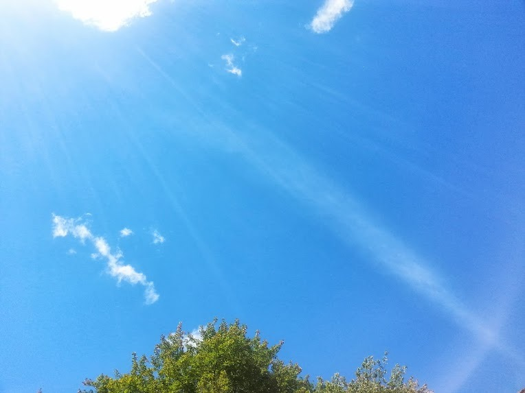

# Weather Dashboard 🌤️

A sleek, modern weather dashboard application built with **HTML**, **CSS**, and **JavaScript**.  
It fetches real-time weather information using the **OpenWeatherMap API** and dynamically updates the UI with beautiful backgrounds based on the weather conditions.

---

## 📸 Preview


---

## 🚀 Features
- Search weather by **city name**
- Display **temperature**, **humidity**, **wind speed**, and **weather condition**
- **Dynamic background images** based on current weather
- **Glassmorphism** styled UI
- **Smooth animations** and **fade-in effects**
- **Responsive design** (Mobile and Desktop)

---

## 🛠️ Technologies Used
- HTML5
- CSS3 (with Flexbox and Media Queries)
- Vanilla JavaScript (ES6+)
- OpenWeatherMap API

---

## 🔑 Setup Instructions

1. **Clone the repository:**
   ```bash
   git clone https://github.com/AmarCodeCraft/Weather-Dashboard.git
   ```

2. **Navigate to the project directory:**   
   ```bash      
   cd weather-dashboard
   ```

3. **Open the `index.html` file in your preferred web browser.**

4. **Enter a city name in the search bar and click the "Search" button.**

5. **Wait for the weather information to load and the background image to change.**

6. **Enjoy the sleek, modern weather dashboard experience!**

---

## 📝 License
This project is licensed under the MIT License.  
You can find the license terms [here](LICENSE.md).

---

## 📧 Contact
If you have any questions, suggestions, or feedback, please don't hesitate to reach out!  
You can find my contact details [here](https://amarcodecraft.github.io/Contact/).

---

## 🎉 Happy Coding!

--- 

[](https://github.com/AmarCodeCraft)
[](https://twitter.com/AmarCodeCraft)
[](https://openweathermap.org/)
